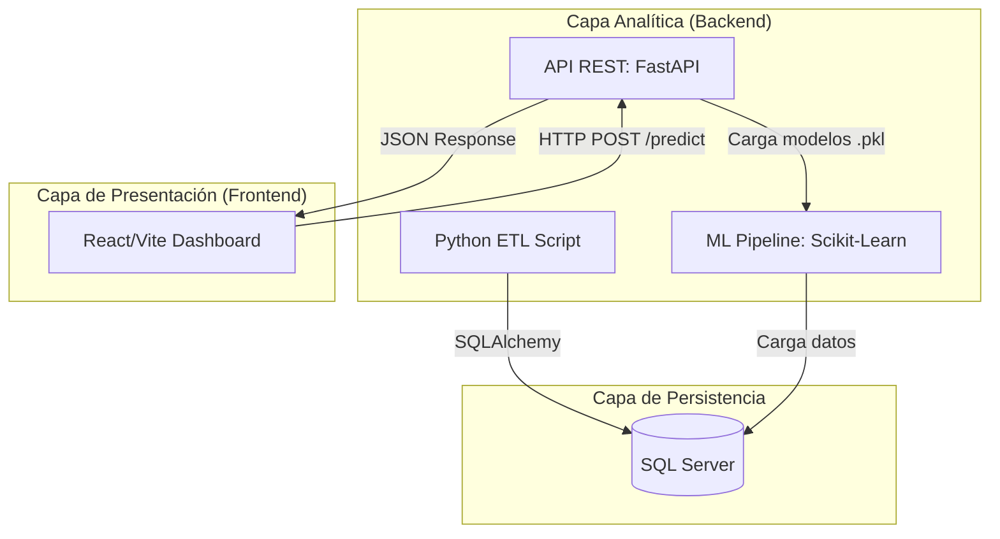

# Sistema de Segmentación de Clientes Bancarios con Machine Learning

## 1. Resumen Ejecutivo

Este proyecto presenta una solución integral para la segmentación de clientes en el sector bancario. El sistema abarca desde la ingesta y modelado de datos en un **Data Warehouse (SQL Server)**, pasando por el entrenamiento de un modelo de **Machine Learning no supervisado (K-Means)**, hasta su despliegue como un microservicio a través de una **API REST (FastAPI)** consumida por un **dashboard interactivo (React)**.

El objetivo es identificar patrones de comportamiento financiero en una cartera de más de 880,000 clientes. Para ello, se aplica un análisis **RFM (Recency, Frequency, Monetary)**, enriquecido con el saldo promedio en cuenta (`Avg_Account_Balance`), para derivar segmentos de clientes accionables que permitan a la institución tomar decisiones estratégicas informadas.

---

## 2. Arquitectura del Sistema
El proyecto se basa en una arquitectura desacoplada de tres capas, lo que garantiza la escalabilidad y mantenibilidad de cada componente de forma independiente.

1. **Capa de Persistencia y ETL (Base de Datos):** SQL Server / T-SQL.
2. **Capa Analítica y de Inferencia (Backend):** Python, Scikit-Learn, FastAPI.
3. **Capa de Presentación (Frontend):** React, Vite, Axios.



## 3. Estructura del Repositorio
```
Bank_Analysis/
├── client/                            # Capa Frontend (React)
│   ├── src/
│   │   ├── pages/
│   │   │   ├── Predictor.jsx          # Formulario de inferencia en tiempo real
│   │   │   └── Segments.jsx           # Detalle analítico de centroides
│   │   ├── services/api.js            # Cliente Axios para la API
│   │   └── utils/segmentData.js       # Datos estáticos de segmentos
│   └── vite.config.js
├── data/
│   └── processed/customer_segments.csv # Dataset final con etiquetas de clúster
├── notebooks/
│   └── 01_eda_rfm.ipynb               # Análisis Exploratorio y justificación del modelo
├── src/                               # Capa Backend (Python)
│   ├── api/main.py                    # Servidor FastAPI y endpoint de predicción
│   ├── database/
│   │   ├── connection.py              # Motor SQLAlchemy para SQL Server
│   │   ├── schemas.sql                # DDL para el Data Warehouse
│   │   └── analytical_views.sql       # DDL para la vista RFM
│   ├── etl/ingest_data.py             # Script de ingesta de datos brutos
│   └── models/
│       ├── segmentation_model.py      # Pipeline de entrenamiento y serialización
│       ├── kmeans_model.pkl           # Modelo K-Means serializado
│       └── scaler.pkl                 # Estandarizador (Scaler) serializado
├── .gitignore
├── README.md                          # Documentación del proyecto
└── requirements.txt                   # Dependencias de Python
```

## 4. Capa de Datos: ETL y Data Warehouse
La base del análisis es una vista (`vw_RFM_Matrix`) construida en un Data Warehouse en SQL Server. Esta vista pre-procesa y agrega el historial transaccional para generar la matriz de características de cada cliente.

### 4.1. Métricas RFM Extendidas
Se calcularon cuatro dimensiones cuantitativas clave:
- **Recencia (Recency):** Días desde la última transacción del cliente hasta la fecha de corte del análisis. Se calcula relativo a la fecha máxima del dataset para asegurar consistencia histórica.
- **Frecuencia (Frequency):** Número total de transacciones realizadas.
- **Monto (Monetary_Volume):** Suma total del valor de las transacciones.
- **Saldo Promedio (Avg_Account_Balance):** Liquidez media que el cliente mantiene en su cuenta.

## 5. Capa Analítica: Pipeline de Machine Learning

### 5.1. Preprocesamiento de Datos
El algoritmo K-Means es sensible a la escala y distribución de las variables. Por ello, se aplicó un pipeline de preprocesamiento riguroso:
1.  **Limpieza:** Se eliminaron registros con valores nulos y se filtraron datos atípicos negativos (ej. saldos negativos).
2.  **Transformación Logarítmica:** Se aplicó la función $f(x) = \ln(1 + x)$ para corregir la alta asimetría positiva (skewness) de las variables monetarias y de frecuencia.
3.  **Estandarización (Z-Score):** Las variables transformadas se escalaron para tener una media $\mu=0$ y una desviación estándar $\sigma=1$, asegurando que todas contribuyan por igual al cálculo de distancias euclidianas.

$$
Z = \frac{x - \mu}{\sigma}
$$

### 5.2. Modelado y Entrenamiento
- **Algoritmo:** Se eligió **MiniBatchKMeans** debido a la eficiencia computacional y de memoria que ofrece para datasets grandes (~882,600 registros), procesando los datos en lotes (`batch_size=10000`).
- **Selección de Hiperparámetros:** Se utilizó el **Método del Codo (Elbow Method)** para determinar el número óptimo de clústeres. Se evaluó la inercia (Suma de Errores al Cuadrado) para $k$ desde 1 hasta 10, identificando $k=6$ como el punto donde la reducción de la inercia se vuelve marginal, logrando un balance entre cohesión de clúster y complejidad del modelo.

### 5.3. Interpretación de Segmentos (Centroides)
El resultado del clustering es un conjunto de 6 perfiles de cliente, definidos por los centroides (valores promedio) de cada grupo. Tras revertir las transformaciones matemáticas, se obtuvieron los siguientes perfiles de negocio:

| Clúster | Caracterización de Negocio | Recencia (días) | Frecuencia (tx) | Volumen Monetario ($) | Saldo Promedio ($) |
|:-------:|:---------------------------|:---------------:|:-----------------:|:---------------------:|:------------------:|
| 0       | **Clientes Frecuentes**    | 46.30           | 2.12              | 1,457.92              | 30,853.86          |
| 1       | **Alto Valor Estático**    | 60.36           | 1.00              | 1,770.64              | 58,778.53          |
| 2       | **Masas - Transacción Única** | 63.49           | 1.00              | 109.57                | 13,549.46          |
| 3       | **Clientes Activos/Recientes** | 0.00            | 1.30              | 686.23                | 20,373.17          |
| 4       | **Masas - Saldo Moderado** | 39.40           | 1.00              | 396.94                | 15,245.05          |
| 5       | **Bajo Valor / Inactivos** | 56.95           | 1.01              | 253.98                | 71.43              |

### 5.4. Valor Analítico y Comercial
La segmentación permite pasar del análisis de 880,000 individuos a 6 perfiles manejables, facilitando la toma de decisiones estratégicas:
- **Personalización:** Diseñar campañas de marketing y productos específicos para cada segmento (ej. fidelización para el Clúster 0, gestión patrimonial para el Clúster 1).
- **Eficiencia de Recursos:** Optimizar la inversión en marketing, enfocando esfuerzos en los clientes de alto valor y minimizando el gasto en segmentos de baja rentabilidad o alto riesgo de abandono (Clúster 5).
- **Escalabilidad:** El pipeline permite clasificar nuevos clientes en tiempo real a medida que ingresan datos al sistema.

## 6. Capa de Servicio: API REST con FastAPI
Para operacionalizar el modelo, se desarrolló un microservicio de inferencia:
- **Serialización:** El `StandardScaler` y el modelo `MiniBatchKMeans` entrenados se serializaron usando `joblib` en los archivos `scaler.pkl` y `kmeans_model.pkl`.
- **Endpoint de Inferencia:** Se expuso un endpoint `POST /predict_segment` que recibe un JSON con las cuatro métricas RFM de un cliente.
- **Proceso en Tiempo Real:** La API carga los artefactos `.pkl` en memoria y, para cada petición, aplica el mismo pipeline de preprocesamiento para predecir el clúster correspondiente en milisegundos.
- **CORS:** Se configuró un middleware para permitir peticiones desde el cliente React durante el desarrollo local (`http://localhost:5173`).

## 7. Guía de Ejecución Local

### 7.1. Prerrequisitos
- Python 3.10+
- Node.js 18+ y npm
- SQL Server con la base de datos configurada
- Archivo `.env` en la raíz con las credenciales de conexión

### 7.2. Paso 1: Clonar el repositorio y preparar el entorno Python
```bash
git clone https://github.com/Gabriel15278/bank-customer-segmentation-system
cd Bank_Analysis

python -m venv venv
.\venv\Scripts\activate      # Windows
# source venv/bin/activate  # macOS/Linux

pip install -r requirements.txt
```

### 7.3. Paso 2: Preparar la base de datos y la vista analítica
Ejecute los scripts en este orden:

1. `src/database/schemas.sql`
2. `src/database/etl_transform.sql`
3. `src/database/analytical_views.sql`

Esto crea la estructura de la base de datos, transforma la información y genera la vista `vw_RFM_Matrix` que usa el modelo.

### 7.4. Paso 3: Entrenar y serializar el modelo
```bash
python src/models/segmentation_model.py
```

Este proceso conecta con la base de datos, genera la matriz RFM, entrena el modelo K-Means y guarda los artefactos `scaler.pkl` y `kmeans_model.pkl`.

### 7.5. Paso 4: Iniciar la API FastAPI
```bash
uvicorn src.api.main:app --reload
```

La API queda disponible en:
- `http://127.0.0.1:8000`

### 7.6. Paso 5: Iniciar el frontend React
Abre una nueva terminal y ejecuta:

```bash
cd client
npm install
npm run dev
```

La aplicación web queda disponible en:
- `http://localhost:5173`

### 7.7. Orden correcto de ejecución
Para que todo funcione de forma consistente, el flujo recomendado es:

1. Preparar el entorno Python
2. Crear la base de datos y vista analítica
3. Entrenar el modelo
4. Levantar la API
5. Levantar el frontend

> Si se ejecuta la API o el frontend antes de tener los datos y el modelo generados, la aplicación no tendrá la información necesaria para responder correctamente.